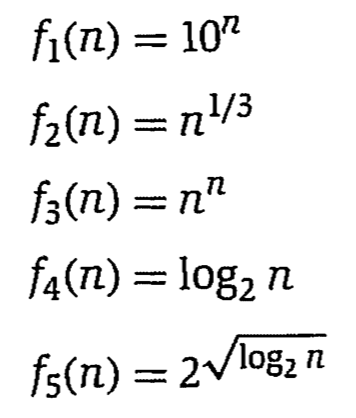
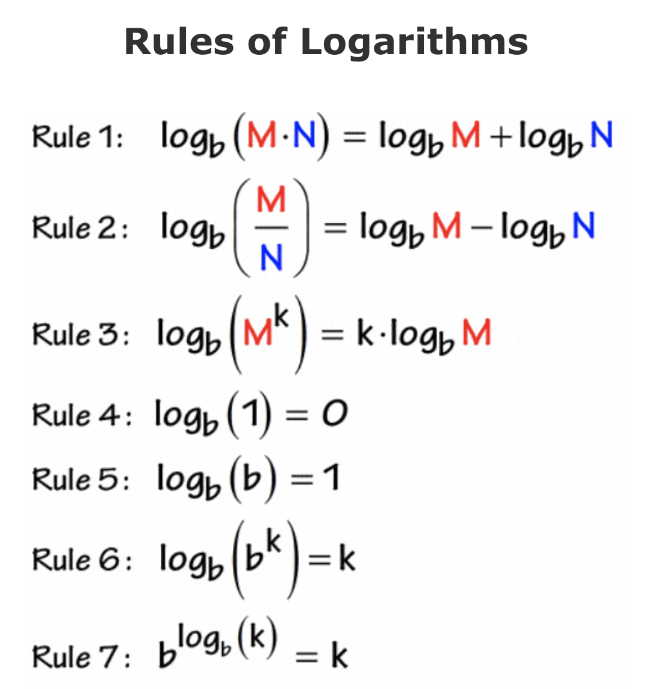

### Solved Exercise 1)
>Take the following list of functions and arrange them in ascending order of growth rate. That is, if function g(n) immediately follows function f(n) in your list, then it should be the case that f(n) is O(g(n)).

>

The order of functions from slowest to fastest is logarithmic -> polynomial -> exponential
 
log2(n) is logarithmic, n^(1/3) is polynomial, and 10^n is expotential. So far, we have:

Slowest&nbsp;&nbsp;&nbsp;&nbsp;&nbsp;&nbsp;&nbsp;&nbsp;&nbsp;&nbsp;&nbsp;&nbsp;&nbsp;&nbsp;&nbsp;&nbsp;&nbsp;&nbsp;&nbsp;&nbsp;&nbsp;&nbsp;&nbsp;&nbsp;&nbsp;&nbsp;&nbsp;&nbsp;&nbsp;&nbsp;&nbsp;&nbsp;&nbsp;&nbsp;&nbsp;&nbsp;&nbsp;&nbsp;&nbsp;&nbsp;&nbsp;&nbsp;&nbsp;&nbsp;&nbsp;&nbsp;&nbsp;&nbsp;&nbsp;&nbsp;&nbsp;&nbsp;&nbsp;&nbsp;&nbsp;&nbsp;&nbsp;&nbsp;&nbsp;&nbsp;&nbsp;&nbsp;&nbsp;&nbsp;&nbsp;&nbsp;&nbsp;&nbsp;&nbsp;&nbsp;&nbsp;&nbsp;&nbsp;&nbsp;&nbsp;&nbsp;&nbsp;&nbsp;&nbsp;&nbsp;&nbsp;&nbsp;&nbsp;&nbsp;&nbsp;&nbsp;&nbsp;Fastest

&nbsp;&nbsp;&nbsp;&nbsp;&nbsp;&nbsp;&nbsp;&nbsp;&nbsp;...log2(n)&nbsp;&nbsp;&nbsp;&nbsp;&nbsp;&nbsp;&nbsp;&nbsp;&nbsp;&nbsp;&nbsp;&nbsp;&nbsp;&nbsp;&nbsp;&nbsp;&nbsp;&nbsp;n^(1/3)&nbsp;&nbsp;&nbsp;&nbsp;&nbsp;&nbsp;&nbsp;&nbsp;&nbsp;
&nbsp;&nbsp;&nbsp;&nbsp;&nbsp;&nbsp;&nbsp;&nbsp;&nbsp;10^n...

n^n is easiest to compare to 10^n. We can see that when n > 10, n^n will be greater than 10^n. So now we have:

 
Slowest&nbsp;&nbsp;&nbsp;&nbsp;&nbsp;&nbsp;&nbsp;&nbsp;&nbsp;&nbsp;&nbsp;&nbsp;&nbsp;&nbsp;&nbsp;&nbsp;&nbsp;&nbsp;&nbsp;&nbsp;&nbsp;&nbsp;&nbsp;&nbsp;&nbsp;&nbsp;&nbsp;&nbsp;&nbsp;&nbsp;&nbsp;&nbsp;&nbsp;&nbsp;&nbsp;&nbsp;&nbsp;&nbsp;&nbsp;&nbsp;&nbsp;&nbsp;&nbsp;&nbsp;&nbsp;&nbsp;&nbsp;&nbsp;&nbsp;&nbsp;&nbsp;&nbsp;&nbsp;&nbsp;&nbsp;&nbsp;&nbsp;&nbsp;&nbsp;&nbsp;&nbsp;&nbsp;&nbsp;&nbsp;&nbsp;&nbsp;&nbsp;&nbsp;&nbsp;&nbsp;&nbsp;&nbsp;&nbsp;&nbsp;&nbsp;&nbsp;&nbsp;&nbsp;&nbsp;&nbsp;&nbsp;&nbsp;&nbsp;&nbsp;&nbsp;&nbsp;&nbsp;Fastest

&nbsp;&nbsp;&nbsp;&nbsp;&nbsp;&nbsp;&nbsp;...log2(n)&nbsp;&nbsp;&nbsp;&nbsp;&nbsp;&nbsp;&nbsp;&nbsp;&nbsp;&nbsp;&nbsp;&nbsp;&nbsp;&nbsp;&nbsp;&nbsp;&nbsp;&nbsp;n^(1/3)&nbsp;&nbsp;&nbsp;&nbsp;&nbsp;&nbsp;&nbsp;
&nbsp;&nbsp;&nbsp;&nbsp;&nbsp;&nbsp;&nbsp;&nbsp;&nbsp;10^n&nbsp;&nbsp;&nbsp;&nbsp;&nbsp;&nbsp;&nbsp;&nbsp;
&nbsp;&nbsp;&nbsp;&nbsp;&nbsp;&nbsp;&nbsp;n^n...

The last to compare is 2^sqrt(log2(n)). <u>A useful rule of thumb in such situations is to try taking logarithms to see whether this makes things clearer.</u> 
 
Using rule 6, log2(2^sqrt(log2(n))) = sqrt(log2(n)) or log2(n)^(1/2).  
In order to have a fair comparison, let's take the log of 
* n^(1/3) = 1/3 * log2(n)  
* log2(n) = log2(log2(n)) 

By replacing log2(n) with "z", we have:
* 1/3 * z
* log2(z)
* z^(1/2) 
 
Let's test z = 100. We can see that (1/3) * 100 = 33.3 is much bigger than log2(100) = 6.64 and 100^(1/2) = 10 (2nd place). The final order is:

 
Slowest&nbsp;&nbsp;&nbsp;&nbsp;&nbsp;&nbsp;&nbsp;&nbsp;&nbsp;&nbsp;&nbsp;&nbsp;&nbsp;&nbsp;&nbsp;&nbsp;&nbsp;&nbsp;&nbsp;&nbsp;&nbsp;&nbsp;&nbsp;&nbsp;&nbsp;&nbsp;&nbsp;&nbsp;&nbsp;&nbsp;&nbsp;&nbsp;&nbsp;&nbsp;&nbsp;&nbsp;&nbsp;&nbsp;&nbsp;&nbsp;&nbsp;&nbsp;&nbsp;&nbsp;&nbsp;&nbsp;&nbsp;&nbsp;&nbsp;&nbsp;&nbsp;&nbsp;&nbsp;&nbsp;&nbsp;&nbsp;&nbsp;&nbsp;&nbsp;&nbsp;&nbsp;&nbsp;&nbsp;&nbsp;&nbsp;&nbsp;&nbsp;&nbsp;&nbsp;&nbsp;&nbsp;&nbsp;&nbsp;&nbsp;&nbsp;&nbsp;&nbsp;&nbsp;&nbsp;&nbsp;&nbsp;&nbsp;&nbsp;&nbsp;&nbsp;&nbsp;&nbsp;Fastest

&nbsp;&nbsp;&nbsp;log2(n)&nbsp;&nbsp;&nbsp;&nbsp;&nbsp;&nbsp;&nbsp;&nbsp;&nbsp;&nbsp;2^sqrt(log2(n))&nbsp;&nbsp;&nbsp;&nbsp;&nbsp;&nbsp;&nbsp;&nbsp;n^(1/3)&nbsp;&nbsp;&nbsp;&nbsp;&nbsp;&nbsp;&nbsp;
&nbsp;&nbsp;&nbsp;&nbsp;&nbsp;&nbsp;&nbsp;&nbsp;&nbsp;10^n&nbsp;&nbsp;&nbsp;&nbsp;&nbsp;&nbsp;&nbsp;&nbsp;
&nbsp;&nbsp;&nbsp;&nbsp;&nbsp;&nbsp;&nbsp;n^n

### Solved Exercise 2)
>Let f and g be two functions that take nonnegative values, and suppose that f = O(g). Show that g = Ω(f). 

For this problem, we essentially just need to unwind that big O and omega are opposites. If f is upper-bounded by g, that means g is lower-bounded by f. 
* f = O(g)  means there exists a constant c such that f(n) <= c*g(n) for all n >= n0. Thus, (1/c) * f(n) <= g(n)
* For proving g = Ω(f), there exists a constant c such that g(n) >= c * f(n) for all n >= n0. That constant is (1/c) here!

### 1)
> Suppose you have algorithms with the five running times listed below. (Assume these are the exact running times.) How much slower do each of these algorithms get when you (a) double the input size, or (b) increase the input size by one? 
(a) n^2 
(b) n^3 
(c) 100n^2 
(d) nlogn 
(e) 2^n 

When the input size is doubled (n to 2n), n^2 becomes 4n^2, so it gets slower by a **factor of 4**. n^3 becomes 8n^3, so it gets slower by a **factor of 8**. 100n^2 becomes 400n^2, so it gets slower by a **factor of 4**. nlogn becomes 2nlog(2n) = 2nlogn???, so it gets slower by a **factor of 2, plus an additive 2n**. 2^n becomes 2^(2n) - so for n = 1: 2 => 4, n = 2: 4 -> 16, n = 3: 8 -> 64. It gets slower by **the square of the previous running time**.

When the input size is increased by 1 (n to n + 1), n^2 becomes (n + 1)^2 or n^2 + 2n + 1, which is slower by an **additive of 2n + 1**. n^3 becomes (n + 1)^3 = (n^2 + 2n + 1) * (n + 1) = n^3 + 2n^2 + n + n^2 + 2n + 1 = n^3 + 3n^2 + 3n + 1, which is slower by an **additive of 3n^2 + 3n + 1**. 100n^2 becomes 100(n+1)^2, or 100n^2 + 200n + 100, which is slower by an **additive of 200n + 100**. nlogn becomes (n+1)log(n+1) or nlog(n+1) + log(n+1).... **???** .
2^n becomes 2^(n+1). Since, a^m × a^n = a^m+n, then it becomes 2^n * 2, and therefore becomes slower by a **factor of 2**.

### 2)
>Suppose you have algorithms with the six running times listed below. (Assume these are the exact number of operations performed as a function of the input size n.) Suppose you have a computer that can perform 10^10 operations per second, and you need to compute a result in at most an hour of computation. For each of the algorithms, what is the largest input size n for which you would be able to get the result within an hour? 
(a) n^2 
(b) n^3 
(c) 100n^2 
(d) nlogn 
(e) 2^n 
(f) 2^2^n

10^10 operations per second, 3,600 seconds in an hour.  
* n^2 = 10^10 * 3600 --> n = 6,000,000 
* n^3 = 10^10 * 3600 = (10^10 * 3600)^(1/3) --> n = 33,019
* 100n^2 = 10^10 * 3600 --> n = 600,000
* nlogn = 10^10 * 3600,  logn * e^(logn) = 10^10 * 3600,  
log(n) = (10^10 * 3600) * e ^(10^10 * 3600), --> n = 9 * 10^11????
* 2^n = 10^10 * 3600. Recall a^x = N -> x = loga(N). So n = log2(10^10 * 3600) (base of 2 matters) --> n = 45
* 2^2^n = 10^10 * 3600. Recall a^x = N -> x = loga(N). So 2^n = log2(10^10 * 3600) and then, do it again and n = log2(log2(10^10 * 3600)) --> n = 5

### 3)
> Take the following list of functions and arrange the min ascending order of growth rate. That is, if function g(n) immediately follows function f(n) in your list, then it should be the case that f(n) is O(g(n)). 
f1(n) = n^(2.5) 
f2(n) = sqrt(2n) 
f3(n) = n + 10 
f4(n) = 10^n 
f5(n) = 100^n 
f6(n) = n^2*logn

Notes: sqrt(2n) = 2n^(1/2) 
 
We know polynomials grower slow than exponentials so 100^n and 10^n go last (fastest). 
n^2*logn grows FASTER than n^2, and we know that logarithms grow <u>slower</u> than polynomials, so it grows slower than n^c for any c > 2. Therefore it goes between f3(n) and f1(n).  

Slowest&nbsp;&nbsp;&nbsp;&nbsp;&nbsp;&nbsp;&nbsp;&nbsp;&nbsp;&nbsp;&nbsp;&nbsp;&nbsp;&nbsp;&nbsp;&nbsp;&nbsp;&nbsp;&nbsp;&nbsp;&nbsp;&nbsp;&nbsp;&nbsp;&nbsp;&nbsp;&nbsp;&nbsp;&nbsp;&nbsp;&nbsp;&nbsp;&nbsp;&nbsp;&nbsp;&nbsp;&nbsp;&nbsp;&nbsp;&nbsp;&nbsp;&nbsp;&nbsp;&nbsp;&nbsp;&nbsp;&nbsp;&nbsp;&nbsp;&nbsp;&nbsp;&nbsp;&nbsp;&nbsp;&nbsp;&nbsp;&nbsp;&nbsp;&nbsp;&nbsp;&nbsp;&nbsp;&nbsp;&nbsp;&nbsp;&nbsp;&nbsp;&nbsp;&nbsp;&nbsp;&nbsp;&nbsp;&nbsp;&nbsp;&nbsp;&nbsp;&nbsp;&nbsp;&nbsp;&nbsp;&nbsp;&nbsp;&nbsp;&nbsp;&nbsp;&nbsp;&nbsp;Fastest

&nbsp;&nbsp;&nbsp;sqrt(2n)&nbsp;&nbsp;&nbsp;&nbsp;&nbsp;&nbsp;&nbsp;&nbsp;&nbsp;&nbsp;n + 10&nbsp;&nbsp;&nbsp;&nbsp;&nbsp;&nbsp;&nbsp;&nbsp;&nbsp;&nbsp;n^2*logn&nbsp;&nbsp;&nbsp;&nbsp;&nbsp;&nbsp;&nbsp;&nbsp;&nbsp;&nbsp;n^(2.5)&nbsp;&nbsp;&nbsp;&nbsp;&nbsp;&nbsp;&nbsp;&nbsp;&nbsp;&nbsp;10^n&nbsp;&nbsp;&nbsp;&nbsp;&nbsp;&nbsp;&nbsp;&nbsp;&nbsp;&nbsp;100^n

### 4)
>Take the following list of functions and arrange the min ascending order of growth rate. That is, if function g(n) immediately follows function f(n) in your list, then it should be the case that f(n) is O(g(n)). 
g1(n) = 2^sqrt(logn) 
g2(n) = 2^n 
g3(n) = n(logn)^3 
g4(n) = n^(4/3) 
g5(n) = n^logn 
g6(n) = 2^2^n 
g7(n) = 2^n^2

First, we can determine that 2^n > 2^sqrt(logn).  
2^2^n > 2^n^2 since the exponential 2^n is greater than the polynomial n^2.
 To combine these four, 2^n is of course smaller than 2^n^2.
 
Now let's compare the rest: n^(4/3), n(logn)^3, or n^logn. n^logn > n(logn)^3 > n^(4/3).
 

* g1(n) comes before g5(n). Solve by taking the log. log(2^sqrt(logn)) ? log(n^log(n)) --> sqrt(logn) ? **logn + log(log(n))????? > logn.** So g1(n) < g5(n). 
* g5(n) comes before g3(n) since n^logn = logn^n < n*(logn)^3.
* g3(n) comes before g4(n). Divide both by n to be logn^3 and n^(1/3). Then by 3. logn grows slower than the polynomial n^(1/9).
* g4(n) comes before g2(n) because polynomials grow slower than exponentials. 
* g2(n) comes before g7(n). 2^n < 2^n^2
* g7(n) comes before g6(n) since we are comparing n^2 to 2^n and polynomials grow slower than exponentials

Slowest&nbsp;&nbsp;&nbsp;&nbsp;&nbsp;&nbsp;&nbsp;&nbsp;&nbsp;&nbsp;&nbsp;&nbsp;&nbsp;&nbsp;&nbsp;&nbsp;&nbsp;&nbsp;&nbsp;&nbsp;&nbsp;&nbsp;&nbsp;&nbsp;&nbsp;&nbsp;&nbsp;&nbsp;&nbsp;&nbsp;&nbsp;&nbsp;&nbsp;&nbsp;&nbsp;&nbsp;&nbsp;&nbsp;&nbsp;&nbsp;&nbsp;&nbsp;&nbsp;&nbsp;&nbsp;&nbsp;&nbsp;&nbsp;&nbsp;&nbsp;&nbsp;&nbsp;&nbsp;&nbsp;&nbsp;&nbsp;&nbsp;&nbsp;&nbsp;&nbsp;&nbsp;&nbsp;&nbsp;&nbsp;&nbsp;&nbsp;&nbsp;&nbsp;&nbsp;&nbsp;&nbsp;&nbsp;&nbsp;&nbsp;&nbsp;&nbsp;&nbsp;&nbsp;&nbsp;&nbsp;&nbsp;&nbsp;&nbsp;&nbsp;&nbsp;&nbsp;&nbsp;Fastest

2^sqrt(logn)&nbsp;&nbsp;&nbsp;&nbsp;&nbsp;n^logn&nbsp;&nbsp;&nbsp;&nbsp;&nbsp;n(logn)^3&nbsp;&nbsp;&nbsp;&nbsp;&nbsp;&nbsp;&nbspn^(4/3)&nbsp;&nbsp;&nbsp;&nbsp;&nbsp;&nbsp;&nbsp;2^n&nbsp;&nbsp;&nbsp;&nbsp;&nbsp;&nbsp;&nbsp;&nbsp;2^n^2&nbsp;&nbsp;&nbsp;&nbsp;&nbsp;&nbsp;&nbsp;2^2^n
g1(n)&nbsp;&nbsp;&nbsp;&nbsp;&nbsp;&nbsp;&nbsp;&nbsp;&nbsp;&nbsp;&nbsp;&nbsp;&nbsp;&nbsp;&nbsp;&nbsp;&nbsp;g5(n)&nbsp;&nbsp;&nbsp;&nbsp;&nbsp;&nbsp;&nbsp;&nbsp;g3(n)&nbsp;&nbsp;&nbsp;&nbsp;&nbsp;&nbsp;&nbsp;&nbsp;&nbsp;&nbsp;&nbsp;&nbsp;&nbsp;&nbsp;g4(n)&nbsp;&nbsp;&nbsp;&nbsp;&nbsp;&nbsp;&nbsp;&nbsp;&nbsp;&nbsp;&nbsp;g2(n)&nbsp;&nbsp;&nbsp;&nbsp;&nbsp;&nbsp;g7(n)&nbsp;&nbsp;&nbsp;&nbsp;&nbsp;&nbsp;&nbsp;&nbsp;&nbsp;g6(n)

### 5)
> Assume you have functions f and g such that f(n) is O(g(n)). For each of the following statements, decide whether you think it is true or false and give a proof or counterexample. 
(a) log2f(n) is O(log2g(n))  
(b) 2^f(n) is O(2^g(n)) 
(c) f(n)^2 is O(g(n)^2).

(a) **False**. If f(n) is O(g(n)), this means there exists a constant c such that f(n) <= c\*g(n) for all n >= n0. Thus, we would be saying that log2(f(n)) <= c*log2(g(n)). Log2 acts different with a 1 (it becomes a 0). So if g(n) = 1 and f(n) = 2, then log2(g(n)) is 0, and we can't say that log2(f(n)) <= c\*log2(g(n)).

(b) **False**. If f(n) is O(g(n)), this means there exists a constant c such that f(n) <= c\*g(n) for all n >= n0. We want to decide whether 2^f(n) <= c * 2^(g(n)).
Take f(n) = 2n and g(n) = n. Then 4^n <= c * 2^(n).

(c) **True**. If f(n) is O(g(n)), this means there exists a constant c such that f(n) <= c\*g(n) for all n >= n0. The following also holds: f(n)^2 <= c^2 * g(n)^2 for all n >= n0.

### 6)
>Consider the following basic problem. You're given an array A consisting of n integers A[l], A[2], ... , A[n]. You'd like to output a two-dimensional n-by-n array Bin which B[i,j] (for i <j) contains the sum of array entries A[i] through A[j]-- that is, the sum A[i]+A[i+1]+....+A[j]. (The value of array entry B[i,j] is left unspecified whenever i>=j, so it doesn't matter what is output for these values.) 
Here's a simple algorithm to solve this problem.
For i=1, 2,...,n  
&nbsp;&nbsp;&nbsp;For j=i+1, i+2,...,n 
&nbsp;&nbsp;&nbsp;&nbsp;&nbsp;&nbsp;Add up array entries A[i] through A[j] 
&nbsp;&nbsp;&nbsp;&nbsp;&nbsp;&nbsp;Store the result in B[i,j]  
&nbsp;&nbsp;&nbsp;Endfor 
Endfor 
(a) For some function f that you should choose, give a bound of the form O(f(n)) on the running time of this algorithm on an input of size n (i.e., a bound on the number of operations performed by the algorithm). 
(b) For this same function f, show that the running time of the algorithm on an input of size n is also Ω(n)). (This shows an asymptotically tight bound of Θ(f(n)) on the running time.) 
(c) Although the algorithm you analyzed in parts (a) and (b) is the most natural way to solve the problem-after all, it just iterates through the relevant entries of the array B, filling in a value for each-it contains some highly unnecessary sources of inefficiency. Give a ilifferent algorithm to solve this problem, with an asymptotically better running time. In other words, you should design an algorithm with running time O(g(n)), where lim(n->inf) g(n)/f(n) = 0.

### 7)
> There's a class of folk songs and holiday songs in which each verse consists of the previous verse, with one extra line added on. "The Twelve Days of Christmas" has this property; for example, when you get to the fifth verse, you sing about the five golden rings and then, reprising the lines from the fourth verse, also cover the four calling birds, the three French hens, the two turtle doves, and of course the partridge in the'pear tree. The Aramaic song "Had gadya" from the Passover Haggadah works like this as well, as do many other songs.

These songs tend to last a long time, despite having relatively short scripts. In particular, you can convey the words plus instructions for one of these songs by specifying just the new line that is added in each verse, without having to write out all the previous lines each time. (So the phrase "five golden rings" only has to be wTitten once, even though it will appear in verses five and onward.) 

There's something asymptotic that can be analyzed here. Suppose, for concreteness, that each line has a length that is bounded by a constant c, and suppose that the song, when sung out loud, runs for n words total. Show how to encode such a song using a script that has length f(n), for a function f(n) that grows as slowly as possible.

### 8)
> You're doing some stress-testing on various models of glass jars to determine the height from which they can be dropped and still not break. The setup for this experiment, on a particular type of jar, is as follows. You have a ladder with n rungs, and you want to find the highest rung from which you can drop a copy of the jar and not have it break. We call this the highest safe rung.

It might be natural to try binary search: drop a jar from the middle rung, see if it breaks, and then recursively try from rung n/4 or 3n/4 depending on the outcome. But this has the drawback that you could break a lot of jars in finding the answer.

If your primary goal were to conserve jars, on the other hand, you could try the following strategy. Start by dropping a jar from the first rung, then the second rung, and so forth, climbing one higher each time until the jar breaks. In this way, you only need a single jar-at the moment it breaks, you have the correct answer-but you may have to drop it n times (rather than log n as in the binary search solution).

So here is the trade-off: it seems you can perform fewer drops if you're willing to break more jars. To understand better how this trade- off works at a quantitative level, let's consider how to run this experiment given a fixed "budget" of k>=1 jars. In other words, you have to determine the correct answer-the highest safe rung-and can use at most k jars in doing so.

(a) Suppose you are given a budget of k = 2 jars. Describe a strategy for finding the highest safe rung that requires you to drop ajar at most f(n) times, for some function f(n) that grows slower than linearly. (In other words, it should be the case that lim(n -> inf) f(n)/n = 0.)
(b) Now suppose you have a budget of k > 2 jars, for some given k. Describe a strategy for finding the highest safe rung using at most k jars. If fk(n) denotes the number of times you need to drop a jar according to your strategy,then the functions f1,f2,f3, ...should have the property that each grows asymptotically slower than the previous one: lim(n->inf)fk(n)/fk-1(n) = 0 for each k.
